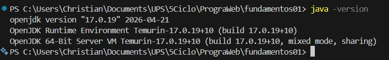
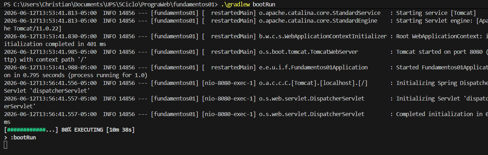
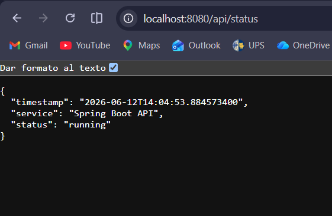
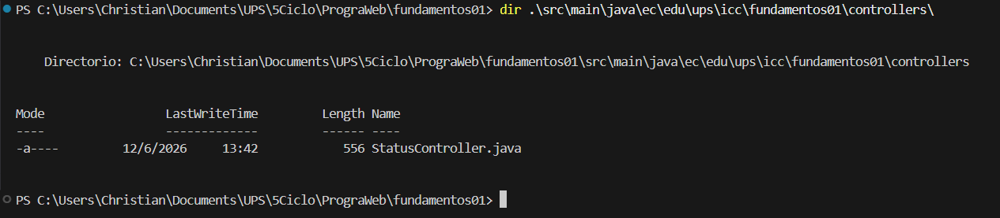

# Resultados y Evidencias

Durante el desarrollo de esta práctica se realizó la instalación y configuración del entorno de trabajo para Spring Boot, la creación de un proyecto utilizando Gradle y la implementación de un endpoint REST para verificar el estado del servicio.

A continuación, se presentan las evidencias obtenidas durante la ejecución de la práctica.

---

## Evidencia 1: Verificación de la instalación de Java

Se verificó correctamente la instalación de Java 17, versión requerida para el funcionamiento de Spring Boot.

---

## Evidencia 2: Ejecución del servidor Spring Boot

Se ejecutó correctamente la aplicación mediante Gradle, observándose el inicio del servidor embebido Tomcat en el puerto 8080.

---

## Evidencia 3: Prueba del endpoint `/api/status`

Se comprobó el funcionamiento del endpoint REST desarrollado para la práctica. La respuesta obtenida se muestra en formato JSON, indicando que el servicio se encuentra en ejecución.

---

## Evidencia 4: Verificación de la estructura del proyecto

Se verificó la existencia del controlador `StatusController.java`, responsable de gestionar la ruta `/api/status`.

---
## Evidencia 5: Endpoint /api/students funcionando

Se verificó el correcto funcionamiento del endpoint encargado de mostrar la lista de estudiantes registrados en memoria. La respuesta se obtuvo en formato JSON, permitiendo visualizar la información almacenada por la aplicación.

Endpoint utilizado:

http://localhost:8080/api/students

---

## Evidencia 6: Endpoint /api/students/count funcionando

Se comprobó el funcionamiento del endpoint encargado de devolver la cantidad total de estudiantes registrados en memoria. La respuesta fue obtenida correctamente en formato JSON.

Endpoint utilizado:

http://localhost:8080/api/students/count

---

## Conclusiones
Se logró instalar y configurar correctamente el entorno de desarrollo para trabajar con Spring Boot utilizando Java 17 y Gradle.
Se comprendió la estructura básica de un proyecto Spring Boot y la función de sus principales componentes.
Se implementaron satisfactoriamente varios controladores REST utilizando las anotaciones @RestController y @GetMapping.
Se verificó el funcionamiento del servidor embebido Tomcat, permitiendo acceder a los servicios web sin necesidad de instalar servidores externos.
Se desarrollaron endpoints para consultar información específica, como el estado del sistema y la gestión de estudiantes almacenados en memoria.
La práctica permitió entender cómo Spring Boot simplifica el desarrollo de aplicaciones backend mediante la auto-configuración y la integración de herramientas modernas para el desarrollo web.
Reflexión Personal

Esta práctica permitió familiarizarse con el ecosistema Spring Boot y comprender la forma en que se construyen aplicaciones web modernas utilizando Java. Además, se observó la facilidad con la que Spring Boot gestiona la configuración inicial del proyecto, permitiendo al desarrollador concentrarse en la lógica de negocio y en la creación de servicios. La implementación de los diferentes endpoints ayudó a comprender el flujo de una petición HTTP, el manejo de datos en memoria y la generación de respuestas en formato JSON. Asimismo, se fortalecieron los conocimientos relacionados con la construcción de APIs REST y la organización de aplicaciones backend utilizando buenas prácticas de desarrollo.