# Programación y Plataformas Web

# Frameworks Backend: Spring Boot - Proyecto Completo

## Autor

Christian Astudillo

## Descripción

Proyecto backend desarrollado con Spring Boot aplicando arquitectura por
capas:

-   Controllers
-   DTOs
-   Models
-   Services
-   Mappers
-   Entities
-   Repositories
-   PostgreSQL
-   Docker
-   Validaciones Jakarta

------------------------------------------------------------------------

# Práctica 1: Instalación y configuración Spring Boot

## Tecnologías

-   Java 25
-   Spring Boot 4.1.0
-   Gradle
-   Spring Web

## Primer endpoint

Ruta:

GET /api/status

Ejemplo:

``` java
@RestController
public class StatusController {

@GetMapping("/api/status")
public Map<String,Object> status(){

return Map.of(
"service","Spring Boot API",
"status","running"
);

}

}
```

------------------------------------------------------------------------

# Práctica 2: Arquitectura modular

Estructura:

``` text
fundamentos01

├── students
├── users
├── categories
├── products
├── security
│
├── controllers
├── services
├── repositories
├── models
├── dtos
├── mapper
└── entity
```

Flujo:

``` text
Cliente
 ↓
Controller
 ↓
DTO
 ↓
Service
 ↓
Repository
 ↓
Database
```

`students` es el módulo con el que arrancó el proyecto en esta
práctica. A partir de la Práctica 3 el CRUD real se construyó sobre
`users` y `products`, y `students` quedó como una demo temprana en
memoria (ver nota en la sección de `Práctica 3`).

------------------------------------------------------------------------

# Práctica 3: CRUD REST

Se implementaron endpoints:

  Método   Ruta
  -------- --------------------
  GET      /api/students
  POST     /api/students
  PUT      /api/students/{id}
  PATCH    /api/students/{id}
  DELETE   /api/students/{id}

Se utilizaron:

-   DTO para entrada y salida
-   Model para lógica
-   Mapper para conversiones

> Nota de estado actual: el `StudentController` que sigue activo en el
> código (`students/controllers/StudentController.java`) es en
> realidad la versión más temprana de esta práctica: guarda los
> estudiantes en una `List<Student>` en memoria y solo expone
> `GET /students` y `GET /students/count`, sin persistencia real. El
> resto del módulo `students` (`StudentEntity`, `StudentRepository`,
> `StudentService`, `StudentMapper`, DTOs) sí se armó siguiendo la
> arquitectura por capas de la Práctica 2, pero **nunca se conectó a
> un controlador** — quedó como código muerto. El CRUD completo con
> DTO + Service + Mapper + Repository que describe esta sección se
> terminó aplicando de verdad sobre `users` y `products`, que es lo
> que documentan las prácticas siguientes.

------------------------------------------------------------------------

# Práctica 4: Servicios

Se eliminó lógica del controlador.

Ahora:

Controller:

``` java
private final UserService service;
```

Service:

``` java
public interface UserService {

List<UserResponseDto> findAll();

UserResponseDto create(CreateUserDto dto);

void delete(Long id);

}
```

Implementación:

``` java
@Service
public class UserServiceImpl implements UserService {


private final UserRepository repository;


public UserServiceImpl(UserRepository repository){

this.repository = repository;

}

}
```

------------------------------------------------------------------------

# Práctica 5: PostgreSQL + Docker + JPA

## Docker

Contenedor:

postgres-dev

Datos:

Usuario: ups

Password: ups123

Base: devdb

Puerto: 5432

Comando:

``` bash
docker exec -it postgres-dev psql -U ups -d devdb
```

------------------------------------------------------------------------

# application.yml (versión inicial)

``` yaml
server:
 port: 8080

spring:

 datasource:

  url: jdbc:postgresql://localhost:5432/devdb

  username: ups

  password: ups123


 jpa:

  hibernate:

   ddl-auto: update

  show-sql: true
```

Esta fue la configuración con la que arrancó el proyecto. Más
adelante (Prácticas 9, 11 y 15) se le agregó `context-path: /api`,
`open-in-view: false` y la sección `jwt`; la versión final completa
queda documentada en la sección **Configuración final** cerca del
final de este documento.

------------------------------------------------------------------------

# Entity

Ejemplo:

``` java
@Entity
@Table(name="products")
public class ProductEntity extends BaseEntity {


@Column(nullable=false)
private String name;


@Column(nullable=false)
private Double price;


@Column(nullable=false)
private Integer stock;


}
```

------------------------------------------------------------------------

# Repository

``` java
@Repository
public interface ProductRepository
extends JpaRepository<ProductEntity,Long>{

}
```

------------------------------------------------------------------------

# Práctica 6: Validación DTO

Dependencia:

``` gradle
implementation("org.springframework.boot:spring-boot-starter-validation")
```

------------------------------------------------------------------------

DTO Producto (versión de esta práctica; en la Práctica 8 se le agregó
además `categoryIds` como campo obligatorio al pasar la relación con
categorías a `@ManyToMany`):

``` java
public class CreateProductDto {


@NotBlank
@Size(min=3,max=150)
private String name;


@NotNull
@DecimalMin(value = "0.0", inclusive = true)
private Double price;


@NotNull
@Min(0)
private Integer stock;


}
```

------------------------------------------------------------------------

Controller:

``` java
@PostMapping
public ProductResponseDto create(
@Valid
@RequestBody
CreateProductDto dto){

return service.create(dto);

}
```

------------------------------------------------------------------------

# Validaciones realizadas

Se verificó:

-   nombre obligatorio
-   precio no negativo
-   stock no negativo
-   email válido
-   campos requeridos

------------------------------------------------------------------------

# Pruebas

Producto inválido:

``` json
{
"name":"",
"price":-5,
"stock":-1
}
```

Respuesta:

``` text
400 Bad Request
```

Producto válido:

``` json
{
"name":"Laptop",
"price":850,
"stock":10
}
```

Resultado esperado:

Producto creado correctamente

------------------------------------------------------------------------

# Evidencias finales

Se comprobó:

-   Spring Boot ejecutándose
-   Endpoint status funcionando
-   CRUD users
-   CRUD products
-   Docker PostgreSQL activo
-   Tablas creadas con JPA
-   Validaciones funcionando

------------------------------------------------------------------------

# Práctica 7: Control Centralizado de Errores y Excepciones

## Problema que resuelve

Antes de esta práctica, cada excepción sin capturar (`IllegalStateException`,
`NullPointerException`, etc.) llegaba al cliente como una respuesta técnica
de Spring Boot, sin un formato uniforme y sin poder distinguir un `404` de
un `409` o un `400`. Se centraliza el manejo de errores para que, sin
importar en qué capa ocurra el problema (DTO, servicio o repositorio), el
cliente siempre reciba la misma estructura de respuesta.

## Excepciones personalizadas

Archivo base, `core/exceptions/base/ApplicationException.java`:

``` java
public class ApplicationException extends RuntimeException {

    private final HttpStatus status;

    public ApplicationException(HttpStatus status, String message) {
        super(message);
        this.status = status;
    }

    public HttpStatus getStatus() {
        return status;
    }
}
```

Excepciones de dominio en `core/exceptions/domain/`, cada una fija su
propio código HTTP:

``` java
public class NotFoundException extends ApplicationException {
    public NotFoundException(String message) {
        super(HttpStatus.NOT_FOUND, message);
    }
}

public class ConflictException extends ApplicationException {
    public ConflictException(String message) {
        super(HttpStatus.CONFLICT, message);
    }
}

public class BadRequestException extends ApplicationException {
    public BadRequestException(String message) {
        super(HttpStatus.BAD_REQUEST, message);
    }
}
```

Se usan en los servicios según el tipo de error:

-   `NotFoundException` → usuario, categoría o producto inexistente/eliminado.
-   `ConflictException` → email o nombre de producto/categoría duplicado.
-   `BadRequestException` → regla de negocio incumplida (por ejemplo, un
    rango de precio inválido en los filtros, o un campo de ordenamiento
    no permitido en la paginación).

## Formato uniforme de error: `ErrorResponse`

``` java
@JsonInclude(JsonInclude.Include.NON_NULL)
public class ErrorResponse {
    private LocalDateTime timestamp;
    private int status;
    private String error;
    private String message;
    private String path;
    private Map<String, String> details;
}
```

`@JsonInclude(NON_NULL)` hace que `details` no aparezca en el JSON cuando
el error no viene de una validación por campos (por ejemplo, un `404`).

## `GlobalExceptionHandler`

Archivo `core/exceptions/handler/GlobalExceptionHandler.java`, anotado con
`@RestControllerAdvice` para aplicarse a todos los controladores. Maneja
siete tipos de excepción:

  Excepción                          Status   Origen
  ----------------------------------- -------- -----------------------------------
  `ApplicationException`              variable  el que traiga la excepción (`getStatus()`)
  `MethodArgumentNotValidException`   400      `@Valid` sobre `@RequestBody`
  `BindException`                     400      `@Valid` sobre `@ModelAttribute` (filtros por query params)
  `AuthorizationDeniedException`      403      `@PreAuthorize` de Spring Security (Práctica 12)
  `AccessDeniedException`             403      lógica propia, p. ej. ownership (Práctica 13)
  `AuthenticationException`           401      fallo de autenticación de Spring Security
  `Exception` (catch-all)             500      cualquier error no controlado

Los dos primeros (y el catch-all) son los que se agregaron en esta
práctica; los otros tres se fueron sumando en las prácticas de
seguridad (12 y 13) a medida que aparecían nuevos tipos de error que
antes cortaban con un `500` en vez de su código correcto.

``` java
@ExceptionHandler(ApplicationException.class)
public ResponseEntity<ErrorResponse> handleApplicationException(
        ApplicationException ex, HttpServletRequest request) {
    ErrorResponse response = new ErrorResponse(
            ex.getStatus(), ex.getMessage(), request.getRequestURI());
    return ResponseEntity.status(ex.getStatus()).body(response);
}

@ExceptionHandler(MethodArgumentNotValidException.class)
public ResponseEntity<ErrorResponse> handleValidationException(
        MethodArgumentNotValidException ex, HttpServletRequest request) {
    Map<String, String> errors = new HashMap<>();
    ex.getBindingResult().getFieldErrors()
            .forEach(error -> errors.put(error.getField(), error.getDefaultMessage()));
    ErrorResponse response = new ErrorResponse(
            HttpStatus.BAD_REQUEST, "Datos de entrada inválidos", request.getRequestURI(), errors);
    return ResponseEntity.badRequest().body(response);
}

@ExceptionHandler(Exception.class)
public ResponseEntity<ErrorResponse> handleUnexpectedException(
        Exception ex, HttpServletRequest request) {
    ErrorResponse response = new ErrorResponse(
            HttpStatus.INTERNAL_SERVER_ERROR, "Error interno del servidor", request.getRequestURI());
    return ResponseEntity.status(HttpStatus.INTERNAL_SERVER_ERROR).body(response);
}
```

(El manejo de `BindException` se agregó en la Práctica 9, y los tres
manejadores de seguridad en las Prácticas 12 y 13; se documentan en
esas secciones.)

## Casos verificados

Evidencia real, capturada corriendo el proyecto en local (Postgres en
Docker + `./gradlew bootRun`) el 2026-07-21:

Usuario inexistente:

```txt
GET /api/users/999
```
```json
{"error":"Not Found","message":"User not found","path":"/api/users/999","status":404,"timestamp":"2026-07-21T20:47:02.8282513"}
```

Email duplicado al registrar:

```txt
POST /api/auth/register
{"name":"Usuario A Repetido","email":"usera@ups.edu.ec","password":"Password123"}
```
```json
{"error":"Conflict","message":"El email ya está registrado","path":"/api/auth/register","status":409,"timestamp":"2026-07-21T20:39:38.0649478"}
```

Cuerpo inválido:

```txt
POST /api/auth/register
{"name":"","email":"correo-invalido","password":"123"}
```
```json
{"details":{"password":"La contraseña debe tener entre 8 y 100 caracteres","name":"El nombre debe tener entre 3 y 150 caracteres","email":"Debe ingresar un email válido"},"error":"Bad Request","message":"Datos de entrada inválidos","path":"/api/auth/register","status":400,"timestamp":"2026-07-21T20:39:38.1413459"}
```

## Explicación breve

Antes de centralizar el manejo de errores, cada controlador o servicio
tendría que armar su propia respuesta de error con `try/catch`, lo que
produce mensajes inconsistentes y expone detalles técnicos innecesarios
(stacktraces, nombres de clases, mensajes de PostgreSQL). Con
`@RestControllerAdvice`, los servicios solo lanzan la excepción que
corresponde al problema (`NotFoundException`, `ConflictException`,
`BadRequestException`, o dejan que Spring Security lance las suyas) y
es el `GlobalExceptionHandler` quien decide, en un único lugar, cómo
traducir esa excepción a una respuesta HTTP con el formato de
`ErrorResponse`. Esto mantiene los controladores y servicios enfocados
en su propia responsabilidad y garantiza que cualquier endpoint nuevo
responda errores con la misma estructura sin escribir código adicional.

------------------------------------------------------------------------

# Práctica 8: Relaciones Many-to-Many, Foreign Keys y Consultas Relacionales

## Módulo categories

Se agregó el módulo `categories` completo (entidad, DTOs, repositorio,
servicio y controlador), siguiendo la misma arquitectura por capas que
`users` y `products`.

Endpoints:

  Método   Ruta                     Descripción
  -------- ------------------------ -----------------------------------
  GET      /api/categories          Lista categorías activas
  GET      /api/categories/{id}     Obtiene una categoría
  POST     /api/categories          Crea una categoría
  PUT      /api/categories/{id}     Actualiza una categoría
  DELETE   /api/categories/{id}     Elimina lógicamente una categoría

## Relaciones en ProductEntity

`ProductEntity` depende de dos entidades: `UserEntity` (dueño del
producto, relación `@ManyToOne` obligatoria) y `CategoryEntity`, con la
que la relación terminó siendo `@ManyToMany` (un producto puede tener
varias categorías y una categoría varios productos), respaldada por una
tabla intermedia `product_categories`:

``` java
@ManyToOne(optional = false, fetch = FetchType.LAZY)
@JoinColumn(name = "user_id", nullable = false)
private UserEntity owner;

@ManyToMany(fetch = FetchType.LAZY)
@JoinTable(
    name = "product_categories",
    joinColumns = @JoinColumn(name = "product_id"),
    inverseJoinColumns = @JoinColumn(name = "category_id")
)
private Set<CategoryEntity> categories = new HashSet<>();
```

`optional = false` en `owner` impide guardar un producto sin dueño, y
`fetch = FetchType.LAZY` en ambas relaciones evita cargar el usuario y
las categorías completos hasta que el código accede explícitamente a
ellos, lo que evita consultas innecesarias en listados grandes.

Como `open-in-view` está deshabilitado en `application.yml`, el acceso a
`owner`/`categories` (LAZY) solo funciona si ocurre dentro de la misma
transacción que hizo la consulta. Por eso `ProductServiceImpl` se marcó
con `@Transactional`: mantiene la sesión de Hibernate abierta mientras
se arma el `ProductResponseDto` con los datos anidados.

`CreateProductDto`/`UpdateProductDto` reciben un `categoryIds: Set<Long>`
(no un único `categoryId`), y `ProductServiceImpl` resuelve cada id
contra `CategoryRepository` antes de asociarlo al producto, lanzando
`NotFoundException("Category not found")` si alguna categoría no existe
o está eliminada lógicamente.

## Nuevos endpoints de productos

  Método   Ruta                                  Descripción
  -------- ------------------------------------- -----------------------------------
  GET      /api/products/user/{userId}           Lista productos de un usuario
  GET      /api/products/category/{categoryId}   Lista productos de una categoría

## Validaciones agregadas en ProductServiceImpl

-   Usuario inexistente o eliminado → `404 Not Found`
-   Categoría inexistente o eliminada → `404 Not Found`
-   Producto inexistente o eliminado → `404 Not Found`
-   Nombre de producto duplicado → `409 Conflict`

------------------------------------------------------------------------

# Práctica 9: Request Parameters, Consultas Relacionadas y Filtrado con JPA

## Objetivo

Consultar productos desde el contexto semántico de `users` y `categories`
(`/api/users/{id}/products`, `/api/categories/{id}/products`) aplicando
filtros opcionales por query params, en lugar de usar únicamente los
endpoints técnicos `/api/products/user/{userId}` y
`/api/products/category/{categoryId}` agregados en la Práctica 8.

## Dos DTOs de filtro, uno por contexto

A diferencia de tener un único DTO con los cinco campos posibles, cada
contexto terminó con su propio DTO, sin el id que ya llega por
`@PathVariable`:

``` java
public class ProductFilterByUserDto {

    @Size(min = 2, max = 150)
    private String name;

    @DecimalMin(value = "0.0", inclusive = true)
    private Double minPrice;

    @DecimalMin(value = "0.0", inclusive = true)
    private Double maxPrice;

    @Min(value = 1)
    private Long userId;

    public boolean hasValidPriceRange() {
        if (minPrice != null && maxPrice != null) {
            return maxPrice >= minPrice;
        }
        return true;
    }

    public boolean hasEmptyName() { /* ... */ }

    // Getters y setters
}
```

``` java
public class ProductFilterByCategoryDto {

    @Size(min = 2, max = 150)
    private String name;

    @DecimalMin(value = "0.0", inclusive = true)
    private Double minPrice;

    @DecimalMin(value = "0.0", inclusive = true)
    private Double maxPrice;

    @Min(value = 1)
    private Long userId;

    public boolean hasValidPriceRange() {
        if (minPrice != null && maxPrice != null) {
            return maxPrice >= minPrice;
        }
        return true;
    }

    // Getters y setters
}
```

`ProductFilterByUserDto` se usa en `UserController.findProductsByUser`
y `ProductFilterByCategoryDto` en los tres endpoints de productos de
`CategoriesController`. Como el filtro por usuario no expone
`categoryId`, **no es posible filtrar por categoría desde
`/api/users/{id}/products`** — solo por `name`, `minPrice` y
`maxPrice`; el cruce inverso (filtrar por `userId` desde
`/api/categories/{id}/products`) sí existe.

## ProductRepository: consultas con filtros opcionales

``` java
@Query("""
        SELECT p
        FROM ProductEntity p
        WHERE p.deleted = false
          AND p.owner.id = :userId
          AND p.owner.deleted = false
          AND (COALESCE(:name, '') = '' OR LOWER(p.name) LIKE LOWER(CONCAT('%', COALESCE(:name, ''), '%')))
          AND (:minPrice IS NULL OR p.price >= :minPrice)
          AND (:maxPrice IS NULL OR p.price <= :maxPrice)
        """)
List<ProductEntity> findByOwnerIdWithFilters(
        @Param("userId") Long userId,
        @Param("name") String name,
        @Param("minPrice") Double minPrice,
        @Param("maxPrice") Double maxPrice);

@Query("""
        SELECT p
        FROM ProductEntity p
        WHERE p.deleted = false
          AND p.owner.deleted = false
          AND EXISTS (
                SELECT 1 FROM p.categories c
                WHERE c.id = :categoryId AND c.deleted = false
          )
          AND (COALESCE(:name, '') = '' OR LOWER(p.name) LIKE LOWER(CONCAT('%', COALESCE(:name, ''), '%')))
          AND (:minPrice IS NULL OR p.price >= :minPrice)
          AND (:maxPrice IS NULL OR p.price <= :maxPrice)
          AND (:userId IS NULL OR p.owner.id = :userId)
        """)
List<ProductEntity> findByCategoryIdWithFilters(
        @Param("categoryId") Long categoryId,
        @Param("name") String name,
        @Param("minPrice") Double minPrice,
        @Param("maxPrice") Double maxPrice,
        @Param("userId") Long userId);
```

Cada condición sigue el patrón `(:param IS NULL OR <filtro>)`: si el
query param no llega, la condición se evalúa `true` y no restringe la
consulta; si llega, se aplica el filtro sobre la tabla `products` sin
necesidad de traer registros a memoria para filtrarlos en Java. El
filtro por categoría usa `EXISTS (... p.categories ...)` porque la
relación es `@ManyToMany`, no una columna directa.

## GlobalExceptionHandler: BindException (código presente, pero no se dispara en la práctica)

La intención al agregar `ProductFilterByUserDto`/`ProductFilterByCategoryDto`
recibidos por `@ModelAttribute` era que una validación fallida lanzara
`BindException` (superclase de `MethodArgumentNotValidException`) en vez
de `MethodArgumentNotValidException`, así que se agregó un
`@ExceptionHandler(BindException.class)` dedicado con el mensaje
"Parámetros de consulta inválidos".

Al correr el proyecto y probarlo de verdad, esto resultó **no ser
cierto** en la versión de Spring que usa este proyecto: forzando un
filtro inválido (`GET /api/users/1/products?name=a`, que viola
`@Size(min = 2)`), la excepción real que se lanza sigue siendo
`MethodArgumentNotValidException`, así que la respuesta trae el mensaje
"Datos de entrada inválidos" (el del otro handler), no "Parámetros de
consulta inválidos":

```txt
GET /api/users/1/products?name=a
```
```json
{"details":{"name":"El nombre debe tener entre 2 y 150 caracteres"},"error":"Bad Request","message":"Datos de entrada inválidos","path":"/api/users/1/products","status":400,"timestamp":"2026-07-21T20:52:55.684705"}
```

En la práctica, `@Valid @ModelAttribute` como parámetro de un método de
controlador ya lanza `MethodArgumentNotValidException` en las versiones
recientes de Spring MVC, y `BindException` queda sin ningún caso real
que lo dispare — el handler dedicado sigue en el código, pero es
efectivamente código muerto. Queda anotado en los pendientes.

## Endpoints disponibles

  Método   Ruta                                                                 Descripción
  -------- -------------------------------------------------------------------- -----------------------------------
  GET      `/api/users/{id}/products`                                          Lista productos de un usuario
  GET      `/api/users/{id}/products?name=...`                                 Filtra por nombre
  GET      `/api/users/{id}/products?minPrice=...&maxPrice=...`                Filtra por rango de precio
  GET      `/api/categories/{id}/products`                                     Lista productos de una categoría
  GET      `/api/categories/{id}/products?userId=...`                          Filtra por usuario
  GET      `/api/categories/{id}/products?name=...&minPrice=...`               Combina filtros

## Casos verificados (evidencia real)

Capturado corriendo el proyecto en local el 2026-07-21.

Filtro por nombre desde el contexto de usuario, sobre un producto
llamado "Laptop Lenovo" creado en la misma corrida:

```txt
GET /api/users/1/products?name=laptop
```
```json
[{"id":1,"name":"Laptop Lenovo","price":950.0,"stock":8,"owner":{"id":1,"name":"Usuario A","email":"usera@ups.edu.ec"},"categories":[{"id":1,"name":"Computadoras","description":"Equipos de computo"}],"createdAt":"2026-07-21T20:41:14.021967","updatedAt":null}]
```

Filtro por rango de precio desde el contexto de categoría:

```txt
GET /api/categories/1/products?minPrice=500&maxPrice=1000
```
Devolvió el mismo producto ("Laptop Lenovo", 950.0), dentro del rango.

Rango de precio inválido (`minPrice` mayor que `maxPrice`):

```txt
GET /api/users/1/products?minPrice=1500&maxPrice=500
```
```json
{"error":"Bad Request","message":"El precio máximo debe ser mayor o igual al precio mínimo","path":"/api/users/1/products","status":400,"timestamp":"2026-07-21T20:47:02.887475"}
```

Usuario inexistente:

```txt
GET /api/users/999/products
```
```json
{"error":"Not Found","message":"User not found","path":"/api/users/999/products","status":404,"timestamp":"2026-07-21T21:00:08.6122876"}
```

Categoría inexistente:

```txt
GET /api/categories/999/products
```
```json
{"error":"Not Found","message":"Category not found","path":"/api/categories/999/products","status":404,"timestamp":"2026-07-21T21:00:08.6856019"}
```

Filtro inválido en un campo del DTO (ver también la nota sobre
`BindException` más arriba):

```txt
GET /api/users/1/products?name=a
```
```json
{"details":{"name":"El nombre debe tener entre 2 y 150 caracteres"},"error":"Bad Request","message":"Datos de entrada inválidos","path":"/api/users/1/products","status":400,"timestamp":"2026-07-21T20:52:55.684705"}
```

## Explicación breve

**¿Por qué se usa `ProductRepository` para consultar productos aunque el
endpoint esté dentro del contexto `/users/{id}/products`?**

Porque el recurso que se está leyendo sigue siendo `products`, no
`users`. La URL solo describe el contexto semántico desde el cual se
origina la consulta (los productos *de* un usuario), pero los datos que
se necesitan, filtran y paginan viven en la tabla `products`. Si en
lugar de eso se navegara la relación desde `UserEntity` (por ejemplo
agregando `@OneToMany(mappedBy = "owner") Set<ProductEntity> products`),
Hibernate traería la colección completa a memoria y cualquier filtro
(`name`, `minPrice`) tendría que aplicarse con streams en Java en vez de
con SQL, perdiendo la capacidad del motor de base de datos de indexar y
optimizar la consulta. Consultar directamente desde `ProductRepository`
con `@Query` y parámetros opcionales mantiene el filtrado a nivel de
base de datos y no obliga a acoplar `UserEntity` con una colección que
no siempre se necesita.

------------------------------------------------------------------------

# Práctica 10: Paginación con Page y Slice

Hasta la práctica anterior, cualquier endpoint de listado (`GET /api/products`,
`GET /api/categories/{id}/products`) devolvía la colección completa en un
solo `List<ProductResponseDto>`. Mientras la base de datos tenía pocos
registros esto no se notaba, pero es un problema real de rendimiento: cada
petición trae todos los productos, con su `owner` y sus `categories`
anidados, sin importar si el cliente necesita 5 o 5000 resultados. En esta
práctica se agregó paginación real a nivel de repositorio (no en memoria),
usando dos estrategias de Spring Data: `Page` y `Slice`.

## Qué se implementó

`PaginationDto` es el DTO que se recibe por query params (`page`, `size`,
`sortBy`, `direction`):

``` java
public class PaginationDto {

    @Min(value = 0, message = "La página debe ser mayor o igual a 0")
    private int page = 0;

    @Min(value = 1, message = "El tamaño debe ser mayor o igual a 1")
    @Max(value = 100, message = "El tamaño no debe superar 100 registros")
    private int size = 10;

    private String sortBy = "id";

    private String direction = "asc";
}
```

En `ProductServiceImpl` hay un método privado `createPageable(PaginationDto)`
que construye el `Pageable`: normaliza `sortBy` contra una lista blanca de
columnas permitidas (`id`, `name`, `price`, `stock`, `createdAt`,
`updatedAt`) —lanzando `BadRequestException` si no está en la lista— y
normaliza `direction` a `ASC`/`DESC` (case-insensitive), lanzando también
`BadRequestException` si el valor no es válido.

Endpoints agregados:

| Método | Ruta | Descripción |
| ------ | ---- | ----------- |
| GET | `/api/products/page` | Productos activos con `Page` (incluye `totalElements`/`totalPages`) |
| GET | `/api/products/slice` | Productos activos del usuario autenticado con `Slice` (sin contar el total) |
| GET | `/api/categories/{id}/products/page` | Productos de una categoría, con filtros + `Page` |
| GET | `/api/categories/{id}/products/slice` | Productos de una categoría, con filtros + `Slice` |

## Casos verificados (evidencia real)

Capturado corriendo el proyecto en local el 2026-07-21, con dos
productos creados previamente ("Laptop Lenovo" y "Mouse Inalambrico").

`GET /api/products/page?page=0&size=5`:

```json
{"content":[{"id":1,"name":"Laptop Lenovo","price":950.0,"stock":8,"owner":{"id":1,"name":"Usuario A","email":"usera@ups.edu.ec"},"categories":[{"id":1,"name":"Computadoras","description":"Equipos de computo"}],"createdAt":"2026-07-21T20:40:46.113026","updatedAt":null},{"id":2,"name":"Mouse Inalambrico","price":25.5,"stock":40,"owner":{"id":1,"name":"Usuario A","email":"usera@ups.edu.ec"},"categories":[{"id":1,"name":"Computadoras","description":"Equipos de computo"}],"createdAt":"2026-07-21T20:41:27.29844","updatedAt":null}],"empty":false,"first":true,"last":true,"number":0,"numberOfElements":2,"pageable":{"offset":0,"pageNumber":0,"pageSize":5,"paged":true,"sort":{"empty":false,"sorted":true,"unsorted":false},"unpaged":false},"size":5,"sort":{"empty":false,"sorted":true,"unsorted":false},"totalElements":2,"totalPages":1}
```

`GET /api/products/slice?page=0&size=5`: mismo `content`, pero
**confirmado que no trae `totalElements` ni `totalPages`**:

```json
{"content":[{"...":"(mismos dos productos)"}],"empty":false,"first":true,"last":true,"number":0,"numberOfElements":2,"pageable":{"offset":0,"pageNumber":0,"pageSize":5,"paged":true,"sort":{"empty":false,"sorted":true,"unsorted":false},"unpaged":false},"size":5,"sort":{"empty":false,"sorted":true,"unsorted":false}}
```

`GET /api/products/page?page=-1&size=0`:

```json
{"details":{"size":"El tamaño debe ser mayor o igual a 1","page":"La página debe ser mayor o igual a 0"},"error":"Bad Request","message":"Datos de entrada inválidos","path":"/api/products/page","status":400,"timestamp":"2026-07-21T20:47:02.9426243"}
```

(El mensaje es "Datos de entrada inválidos", no un mensaje específico
de paginación — mismo comportamiento real descrito en la nota de
`BindException` de la Práctica 9: `@Valid @ModelAttribute` dispara
`MethodArgumentNotValidException`.)

## Explicación breve

**¿Cuál es la diferencia entre `Page` y `Slice`?**

Las dos traen resultados paginados, pero `Page` además calcula
`totalElements` y `totalPages`, lo que internamente obliga a Spring Data
a ejecutar una segunda consulta `COUNT(*)` sobre la tabla. `Slice` se
salta ese conteo: solo pide `size + 1` registros para saber si existe
una página siguiente (`hasNext()`), y con eso arma `first`/`last` sin
tocar el total. `Page` conviene cuando de verdad se necesita mostrar
"página 2 de 8" en el frontend, y `Slice` cuando solo se necesita
scroll infinito o "cargar más", porque es más barato para la base de
datos.

**¿Por qué la paginación debe aplicarse en el repositorio y no después
de traer todos los datos en memoria?**

Porque si se trajeran todos los productos con `findAll()` y luego se
recortaran con `.subList()` en Java, la base de datos seguiría haciendo
el trabajo pesado de leer y transportar cada fila, cada `owner` y cada
`category` por la red, aunque el cliente solo pida 5 resultados. Eso no
escala: con 10 productos no se nota, pero con 100 000 sería un endpoint
lentísimo y un consumo de memoria innecesario en el propio backend.
Pasarle el `Pageable` directamente a `ProductRepository` hace que sea
PostgreSQL quien resuelva el `LIMIT`/`OFFSET`, que es exactamente para
lo que está optimizado un motor de base de datos.

------------------------------------------------------------------------

# Práctica 11: Autenticación y Autorización con JWT

Todo lo anterior (CRUD de productos, categorías, filtros, paginación)
estaba completamente abierto: cualquiera que conociera la URL podía
crear, editar o borrar cualquier recurso. En esta práctica se agregó
una puerta de entrada real a la API con autenticación basada en JWT
(JSON Web Token), siguiendo el patrón *stateless* que se espera de una
API REST: el servidor no guarda sesión, toda la identidad del usuario
viaja firmada dentro del propio token en cada petición.

## Qué se implementó

- **`RoleEntity`** y el enum `RoleName` (`ROLE_USER`, `ROLE_ADMIN`),
  inicializados automáticamente al arrancar la app con
  `SecurityDataInitializer` (crea los dos roles si no existen; no crea
  ningún usuario administrador por defecto).
- **`UserEntity`** actualizado con relación `ManyToMany` hacia los roles
  (tabla intermedia `user_roles`) y campo `passwordHash`.
- **`RegisterRequestDto`** y **`LoginRequestDto`**, con sus propias
  validaciones (`@Email`, contraseña con mínimo 8 caracteres y al menos
  una mayúscula/minúscula/número).
- **`JwtUtil`**, que genera y valida el token firmado (`jjwt`), con
  tiempo de expiración configurable desde `application.yml`.
- **`JwtAuthenticationFilter`**, que intercepta cada request, extrae el
  header `Authorization: Bearer <token>`, lo valida y deja al usuario
  autenticado en el `SecurityContext`.
- **`JwtAuthenticationEntryPoint`**, que responde `401` con el formato
  `ErrorResponse` cuando no hay token o es inválido — sin este
  componente, Spring Security devolvía su propia página de error por
  defecto en vez de JSON.
- **`SecurityConfig`**, con `/auth/**`, `/status/**`, `/actuator/**` y
  `/swagger-ui/**`/`/v3/api-docs/**` públicos, sesión `STATELESS`, CSRF
  deshabilitado y `.anyRequest().authenticated()` para todo lo demás.
- **`AuthService`** y **`AuthController`**, con los endpoints
  `POST /api/auth/register` y `POST /api/auth/login`.

## Endpoints

  Método   Ruta                  Descripción
  -------- --------------------- --------------------------------------------
  POST     `/api/auth/register`  Registra un usuario nuevo con `ROLE_USER`
  POST     `/api/auth/login`     Autentica y devuelve el token

## Casos verificados (evidencia real)

Capturado corriendo el proyecto en local el 2026-07-21.

Registro exitoso (`201 Created`), con `roles: ["ROLE_USER"]` fijado
por `AuthService.register()` sin que el body lo pidiera:

```txt
POST /api/auth/register
{"name":"Usuario A","email":"usera@ups.edu.ec","password":"Password123"}
```
```json
{"token":"eyJhbGciOiJIUzI1NiJ9...","refreshToken":"eyJhbGciOiJIUzI1NiJ9...","userId":1,"name":"Usuario A","email":"usera@ups.edu.ec","roles":["ROLE_USER"],"type":"Bearer"}
```
(HTTP 201; tokens truncados aquí por espacio, son JWT completos reales)

Login exitoso (`200 OK`), mismo formato con un token nuevo (distinto
al del registro):

```txt
POST /api/auth/login
{"email":"usera@ups.edu.ec","password":"Password123"}
```

Login con contraseña incorrecta:

```json
{"error":"Unauthorized","message":"Credenciales inválidas o sesión expirada","path":"/api/auth/login","status":401,"timestamp":"2026-07-21T20:40:23.5890052"}
```

Endpoint protegido sin token:

```txt
GET /api/products/page?page=0&size=5
```
```json
{"error":"Unauthorized","message":"Token de autenticación inválido o no proporcionado. Debe incluir un token válido en el header Authorization: Bearer <token>","path":"/api/products/page","status":401,"timestamp":"2026-07-21T20:40:23.6771493"}
```

Mismo endpoint con el token del login → `200 OK` (ver evidencia de
`Page`/`Slice` en la Práctica 10, capturada con este mismo token).

------------------------------------------------------------------------

# Práctica 12: Roles y @PreAuthorize

Con JWT ya resuelto quedaba una pregunta abierta: cualquier usuario
autenticado, sin importar su rol, podía llegar a cualquier endpoint. En
esta práctica se agregó una segunda capa de seguridad — autorización
por rol — usando `@PreAuthorize` de Spring Security a nivel de método.

## Qué se implementó

- `@EnableMethodSecurity(prePostEnabled = true)` en `SecurityConfig`
  (necesario para que `@PreAuthorize` funcione).
- `@PreAuthorize("hasRole('ADMIN')")` sobre `ProductController.findAll()`
  (`GET /api/products`) y sobre `UserController.findAll()`
  (`GET /api/users`) — son los dos endpoints que devuelven la lista
  completa sin paginar y sin filtrar por dueño.
- Tres manejadores nuevos en `GlobalExceptionHandler`:
  `AuthorizationDeniedException` (la que lanza `@PreAuthorize` en
  Spring Security 6.x/7.x) y `AccessDeniedException` (la que se usa
  desde código propio, incluida la de ownership en la Práctica 13)
  devuelven `403`; `AuthenticationException` devuelve `401` con el
  mensaje `"Credenciales inválidas o sesión expirada"`. Sin estos
  manejadores, un acceso denegado por rol devolvía `500` en vez de
  `403`.

## Pendiente detectado

El endpoint `GET /api/users/me` (que devolvería `id`, `name`, `email`
y `roles` del usuario autenticado vía `@AuthenticationPrincipal`)
**todavía no está implementado** — no existe ningún
`CurrentUserController` en el código. Queda como tarea pendiente, no
solo de documentación.

## Casos verificados (evidencia real)

Capturado corriendo el proyecto en local el 2026-07-21. Para probar el
caso ADMIN se promovió a un usuario a `ROLE_ADMIN` directamente en
Postgres (`INSERT INTO user_roles ...`) y se volvió a loguear para que
el JWT llevara el rol nuevo en el claim `roles` — no hay ningún
endpoint que auto-asigne `ROLE_ADMIN`, a propósito.

`GET /api/products` con un token `ROLE_USER`:

```json
{"error":"Forbidden","message":"No tienes permisos para acceder a este recurso","path":"/api/products","status":403,"timestamp":"2026-07-21T20:41:27.5130586"}
```

`GET /api/products` con un token `ROLE_ADMIN` (mismo usuario, ya
promovido y con un login nuevo) → `200 OK`, lista completa. `GET
/api/users` con ese mismo token ADMIN también → `200 OK` (confirma
que el `@PreAuthorize("hasRole('ADMIN')")` de `UserController.findAll()`
funciona igual que el de `ProductController`).

## Explicación breve

**¿Cuál es la diferencia entre autenticación y autorización?**

Autenticación responde *¿quién eres?*: es lo que se resolvió en la
Práctica 11 validando el JWT y confirmando que el usuario existe y su
contraseña es correcta. Autorización responde *¿qué puedes hacer?*: una
vez que se sabe quién es el usuario, todavía hay que decidir si tiene
permiso para la acción puntual que está pidiendo. Por eso son dos pasos
distintos y en orden: primero pasa por `JwtAuthenticationFilter`
(autenticación, devuelve `401` si falla) y solo después llega a
`@PreAuthorize` (autorización, devuelve `403` si falla).

**¿Por qué `GET /api/products` debe ser solo para ADMIN, mientras
`GET /api/products/page` puede ser consumido por cualquier usuario
autenticado?**

Porque no son el mismo tipo de consulta. `/api/products` devuelve
*todos* los productos activos del sistema sin paginar y sin ningún
filtro de dueño — en la práctica, expone datos de todos los usuarios en
una sola respuesta, lo cual es información operativa que solo le sirve
a un administrador. `/api/products/page` en cambio está pensado como el
endpoint normal de navegación para cualquier usuario: viene paginado,
no dispara un `SELECT *` gigante, y no revela nada que un usuario común
no debería poder consultar. Restringir el primero y dejar abierto el
segundo es justamente aplicar el principio de menor privilegio: cada
rol solo llega hasta donde necesita.

------------------------------------------------------------------------

# Práctica 13: Validación de Ownership

Con roles ya funcionando faltaba resolver la última pregunta de
seguridad: que un usuario con `ROLE_USER` no pueda modificar o borrar
productos que no le pertenecen, aunque esté perfectamente autenticado y
autorizado a *usar* el endpoint. A esto se le llama *ownership*, y a
diferencia de la Práctica 12 (que se resuelve antes de entrar al
método, con `@PreAuthorize`), esta validación necesita conocer el dato
concreto — el producto — así que vive dentro del servicio.

## Qué se implementó

- Se eliminó cualquier campo `userId` de `CreateProductDto`: el
  servidor ya no confía en lo que mande el cliente en el body para
  decidir quién es el dueño de un producto nuevo.
- Las firmas de `create`, `update`, `partialUpdate` y `delete` en
  `ProductService`/`ProductServiceImpl` reciben `UserDetailsImpl
  currentUser`, inyectado en el controlador con
  `@AuthenticationPrincipal`.
- En `create()`, el owner sale de `findCurrentUserEntity(currentUser)`,
  que reconsulta al usuario en base para asegurarse de que sigue
  existiendo y no está eliminado lógicamente.
- En `update()`, `partialUpdate()` y `delete()` se agregó
  `validateOwnership(entity, currentUser)` justo después de buscar el
  producto: si el usuario tiene `ROLE_ADMIN` puede seguir sin
  restricciones; si no, compara `product.getOwner().getId()` contra
  `currentUser.getId()` y lanza `AccessDeniedException` si no coinciden.
- El handler de `AccessDeniedException` en `GlobalExceptionHandler` usa
  `ex.getMessage()` en vez de un texto fijo (con un mensaje genérico de
  respaldo si no trae ninguno), así el cliente recibe el motivo real
  ("No puedes modificar productos ajenos", "Usuario no autenticado",
  etc.) y no un mensaje genérico.

## Casos verificados (evidencia real)

Capturado corriendo el proyecto en local el 2026-07-21, con "Laptop
Lenovo" (id 1) creado por Usuario A.

`PUT /api/products/1` con el token de Usuario B (no es el dueño):

```json
{"error":"Forbidden","message":"No puedes modificar productos ajenos","path":"/api/products/1","status":403,"timestamp":"2026-07-21T20:42:48.6583591"}
```

`DELETE /api/products/1` con el token de Usuario B → mismo `403` y
mismo mensaje (`validateOwnership()` se reutiliza para `update`,
`partialUpdate` y `delete`).

`PATCH /api/products/1` con el token de Usuario A (el dueño) →
`200 OK`, actualización permitida.

`PUT /api/products/1` con el token de Usuario B **después de
promoverlo a `ROLE_ADMIN`** → `200 OK`: `validateOwnership()` detecta
el rol y deja pasar la modificación aunque no sea el dueño del
producto.

`DELETE /api/products/1` con el token de Usuario A (el dueño real) →
`200 OK`.

## Limitación conocida (confirmada con una prueba real)

`UserController` (`PUT /users/{id}`, `PATCH /users/{id}`,
`DELETE /users/{id}`, `PATCH /users/{id}/password`) **no tiene el mismo
control de ownership** que `ProductController`: no recibe
`@AuthenticationPrincipal` ni valida que el usuario autenticado sea el
mismo `{id}` que está modificando.

Esto no es solo una lectura del código: se probó registrando un tercer
usuario ("Usuario C", sin ninguna relación con la cuenta 1) y
usando su propio token para modificar la cuenta de Usuario A:

```txt
PATCH /api/users/1
Authorization: Bearer <token-usuario-C>
{"name":"Nombre Cambiado Por Otro Usuario"}
```
```json
{"id":1,"name":"Nombre Cambiado Por Otro Usuario","email":"usera@ups.edu.ec"}
```

Respondió `200 OK` y el cambio se aplicó de verdad — cualquier usuario
autenticado puede hoy editar o borrar la cuenta de otro usuario. Queda
como pendiente replicar en `UserServiceImpl` la misma validación de
ownership (o de "solo yo mismo o un ADMIN") que ya existe en
`ProductServiceImpl`.

## Explicación breve

**¿Qué es ownership?**

Es la relación entre un recurso y el usuario dueño de ese recurso — en
este caso, el campo `owner` de `ProductEntity`. Validar ownership
significa comprobar, antes de dejar modificar o borrar algo, que quien
hace la petición sea efectivamente el dueño del registro (o tenga un
permiso especial, como `ROLE_ADMIN`, que le permita saltarse esa regla).
No es lo mismo que autenticación (¿quién eres?) ni que autorización por
rol (¿qué tipo de acciones puedes hacer en general?): ownership es *¿es
tuyo este recurso en particular?*, y por eso solo se puede resolver
después de buscar el recurso concreto en base de datos.

**¿Por qué no es seguro recibir `userId` en `CreateProductDto`?**

Porque si el cliente puede mandar cualquier `userId` en el body, un
usuario autenticado con id `2` podría enviar `"userId": 5` y crear
productos a nombre del usuario `5`, sin que nada se lo impida — el
servidor confiaría ciegamente en un dato que viene del cliente y que es
trivial de falsificar. La única fuente confiable de "quién soy" es el
token JWT que ya fue validado por `JwtAuthenticationFilter`, así que el
owner tiene que salir de ahí (`@AuthenticationPrincipal`), nunca del
body de la petición.

**¿Cuál es la diferencia entre autorización por rol y autorización por
ownership?**

La autorización por rol (Práctica 12, `@PreAuthorize`) se evalúa
*antes* de ejecutar el método, y solo necesita saber el rol del usuario
autenticado — no le importa qué recurso específico se va a tocar. La
autorización por ownership se evalúa *dentro* del servicio, después de
haber buscado el recurso en base de datos, porque necesita comparar un
dato concreto (`product.getOwner().getId()`) contra el usuario actual.
Por eso una vive en `SecurityConfig`/anotaciones y la otra vive como
lógica de negocio en `ProductServiceImpl`: no hay forma de saber si un
producto es "ajeno" sin haberlo consultado primero.

------------------------------------------------------------------------

# Práctica 14: Refresh Tokens con JWT

El access token de 30 minutos que quedó desde la Práctica 11 tenía un
problema molesto: cada vez que expiraba, tocaba volver a loguearse.
Tiene sentido por seguridad (un token que dura poco reduce el daño si
alguien lo roba), pero para cualquier app real es incómodo. Así que en
esta práctica agregué un segundo token, de vida más larga, cuyo único
trabajo es pedir un access token nuevo sin que el usuario tenga que
volver a escribir su contraseña.

## Cómo lo armé

Creé `RefreshTokenEntity` (`security/entities/`) con `user`, `token`,
`expiresAt` y `revoked`. A diferencia del access token, este sí se
guarda en base de datos, porque necesito poder revocarlo o consultarlo,
algo que un JWT firmado no permite por sí solo. Su repositorio
(`RefreshTokenRepository`) solo necesita dos queries:
`findByTokenAndRevokedFalse` y `findByUserIdAndRevokedFalse`.

`AuthResponseDto` ahora devuelve también `refreshToken`, además del
`token` de acceso que ya tenía desde antes.

La parte más delicada fue reescribir `JwtUtil` para que cada token
lleve un claim `type` (`access` o `refresh`). Sin esto, alguien podría
mandar el refresh token en el header `Authorization` y la API lo
aceptaría igual que un access token válido, lo que sería un hueco de
seguridad serio: un refresh token robado serviría para consumir toda
la API durante 7 días en vez de 30 minutos. Por eso `JwtAuthenticationFilter`
ahora llama a `validateAccessToken(jwt)` en vez de una validación
genérica, y rechaza cualquier token que no sea explícitamente de tipo
`access`.

Toda la lógica de creación/validación/revocación quedó en
`RefreshTokenService`: `createRefreshToken()`,
`validateAndGetActiveToken()` (revisa firma, tipo, que exista en base,
que no esté revocado, que no haya expirado y que el usuario siga
activo), `revoke()` y `revokeAllByUser()`.

En `AuthService`, `login()` revoca los refresh tokens anteriores del
usuario antes de generar uno nuevo (dejo una sola sesión activa por
usuario), `register()` genera el par completo desde el inicio,
`refresh()` valida el token recibido, lo revoca y genera un par nuevo
(esto es la rotación), y `logout()` revoca el que se le mande.

De paso aproveché para que `UserDetailsServiceImpl` use
`findByEmailAndDeletedFalse`, así un usuario eliminado lógicamente no
puede seguir autenticándose aunque su contraseña siga siendo válida.

## Endpoints nuevos

  Método   Ruta                 Descripción
  -------- -------------------- ------------------------------------------
  POST     `/api/auth/refresh`  Rota el refresh token y devuelve un par nuevo
  POST     `/api/auth/logout`   Revoca el refresh token recibido (`204`)

## Evidencia

Estas pruebas las hice contra el despliegue en Render
(`pwp67-api.onrender.com`), no en local.

Login: devuelve `token` y `refreshToken` juntos.

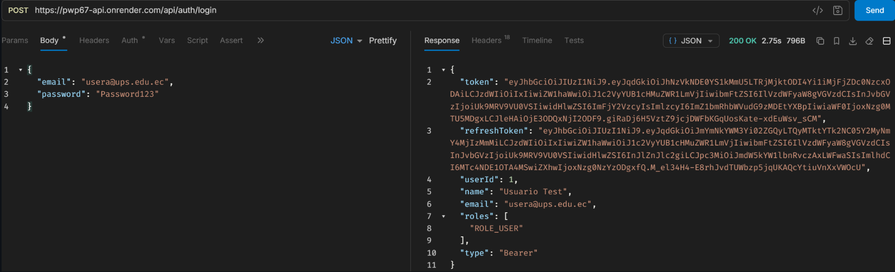

Con ese `refreshToken` pego a `/auth/refresh` y me devuelve un par
nuevo (access y refresh):

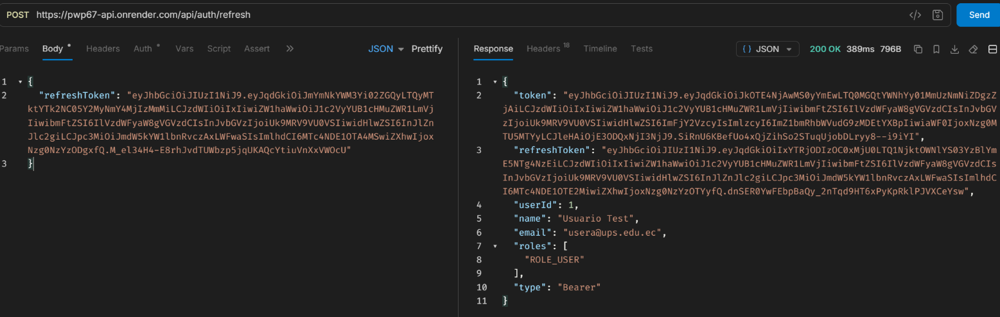

Logout: revoca el refresh token que le mando y responde `204`.

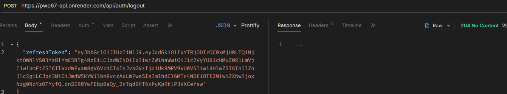

Si intento usar ese mismo refresh token otra vez después del logout,
ya está revocado y responde `400`:

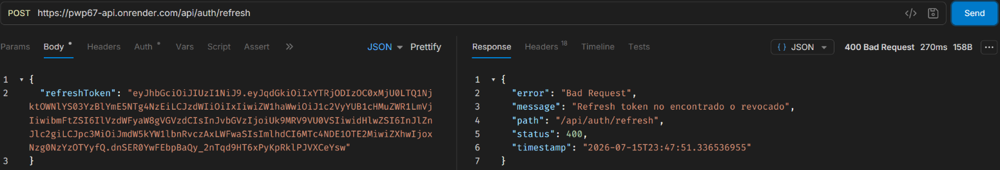

## Explicación breve

**¿Cuál es la diferencia entre access token y refresh token?**

El access token es el que viaja en cada petición
(`Authorization: Bearer <token>`), por eso dura poco: como se manda
todo el tiempo, es lo primero que un atacante intentaría robar. El
refresh token no sirve para consumir nada, solo para pedir un access
token nuevo en `/auth/refresh`, así que puede durar mucho más (7 días)
sin que eso sea tan riesgoso, porque se usa muy pocas veces y además
queda guardado en base de datos, o sea que si algo sale mal se puede
revocar.

**¿Por qué el refresh token no debe usarse en `Authorization: Bearer`?**

Porque si el filtro aceptara cualquier JWT válido sin fijarse en el
tipo, un refresh token robado funcionaría exactamente igual que uno de
acceso, pero por 7 días en vez de 30 minutos. El claim `type` es justo
lo que evita eso: un refresh token que llegue por ese header
simplemente no autentica a nadie.

**¿Qué significa rotar un refresh token?**

Que cada vez que se usa un refresh token para pedir tokens nuevos, ese
mismo se revoca al toque y se genera uno distinto para la próxima vez.
Así nunca se puede reutilizar dos veces: si alguien lo interceptara y
tratara de usarlo después, ya lo encontraría revocado.

------------------------------------------------------------------------

# Práctica 15: Documentación de la API con Swagger y OpenAPI

Hasta esta práctica, la única forma de saber qué endpoints existen y
qué esperan de body era leerse el código directamente. Acá agregué
documentación interactiva con Swagger UI, generada automáticamente
desde anotaciones de OpenAPI, para poder explorar y probar la API
desde el navegador sin tener que abrir el proyecto.

## Cómo lo armé

Agregué la dependencia
`org.springdoc:springdoc-openapi-starter-webmvc-ui:3.0.3` en
`build.gradle`. Con eso ya se genera automáticamente la documentación
a partir de los controladores, pero para que se viera bien tuve que
crear `OpenApiConfig` (`security/config/`) con el título "API de
Programación y Plataformas Web", la versión `1.0.0`, un servidor
(`/api`, "Servidor local") y el esquema de seguridad `bearerAuth` (tipo
HTTP, scheme `bearer`, formato `JWT`). Ese esquema es justo lo que hace
aparecer el botón Authorize en Swagger UI.

También tuve que tocar `SecurityConfig`, porque como ya tenía
`.anyRequest().authenticated()` desde la Práctica 11, Swagger UI
quedaba bloqueado igual que cualquier otro endpoint. Agregué:

```java
.requestMatchers("/swagger-ui/**", "/swagger-ui.html", "/v3/api-docs/**").permitAll()
```

Sin esto, `/v3/api-docs` (el JSON que Swagger UI necesita para dibujar
la página) respondía `401` en vez de servir la documentación.

Después documenté los controladores. En `AuthController` agregué
`@Tag(name = "Autenticación", ...)` y `@Operation`/`@ApiResponse` en
los cuatro endpoints (login, register, refresh, logout), con los
códigos `200/201`, `400`, `401` y `409` de cada uno. En
`ProductController` agregué `@Tag(name = "Productos", ...)` y
`@SecurityRequirement(name = "bearerAuth")` a nivel de clase, para que
Swagger sepa que todos sus endpoints necesitan el candado de
autenticación, más `@Operation`/`@ApiResponse` en los diez métodos,
incluyendo la aclaración de que `findAll()` requiere `ROLE_ADMIN`.

Con `server.servlet.context-path: /api`, las rutas quedaron:

```txt
http://<host>/api/swagger-ui/index.html
http://<host>/api/v3/api-docs
```

## Evidencia

Swagger UI cargado, con los controladores agrupados por tags:

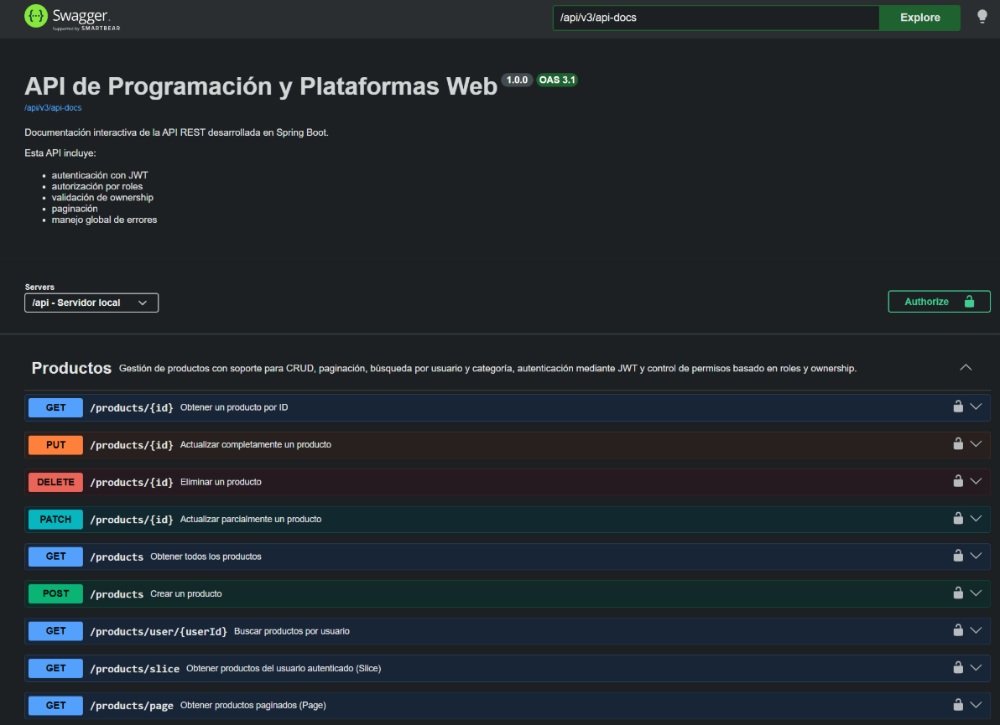

El JSON de OpenAPI en `/api/v3/api-docs`:

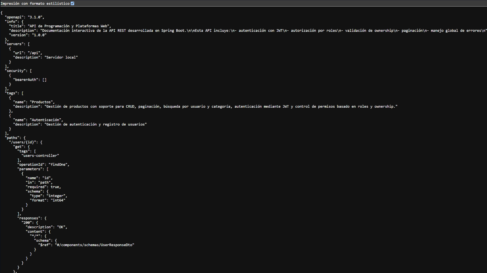

`AuthController` documentado, con sus cuatro endpoints:

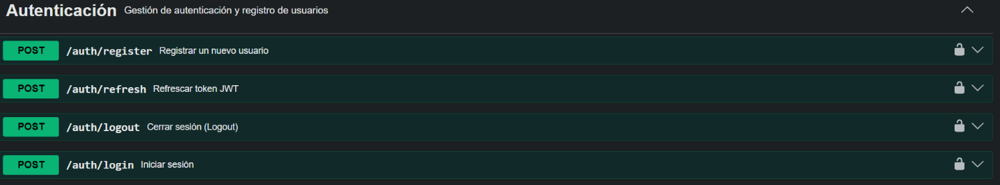

El botón Authorize, pegando ahí el token generado en el login:

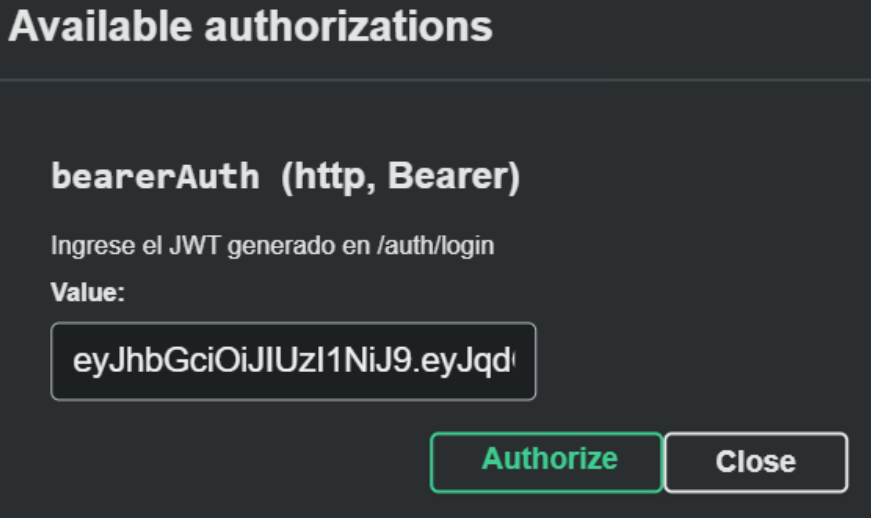

Un endpoint protegido sin token responde `401`:

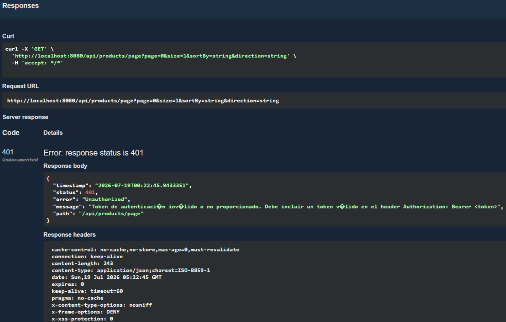

El mismo endpoint, ya autorizado con el token desde Swagger, responde
`200`:

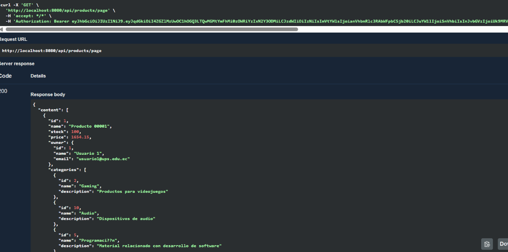

`GET /api/products` con un usuario `ROLE_USER` responde `403`:

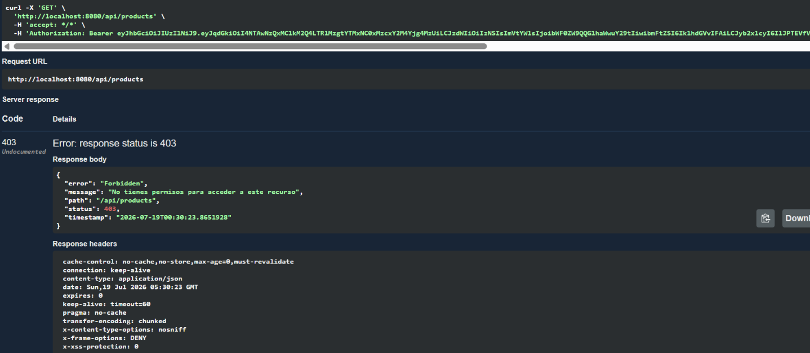

El mismo endpoint con un usuario `ROLE_ADMIN` responde `200`:

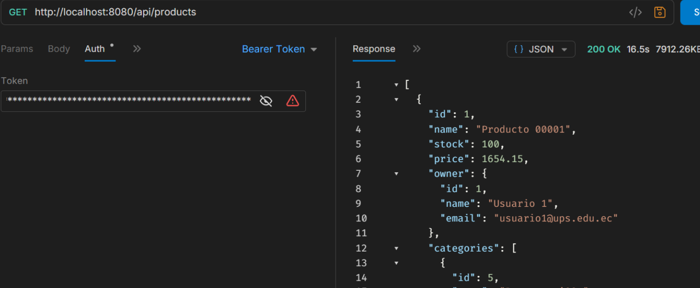

## Explicación breve

**¿Cuál es la diferencia entre Swagger UI y OpenAPI?**

OpenAPI es la especificación: un documento JSON que describe de forma
estandarizada qué endpoints tiene la API, qué reciben, qué devuelven y
cómo se autentican, que es justo lo que se ve en `/api/v3/api-docs`.
Swagger UI es solo una de las herramientas que saben leer ese documento
y dibujarlo como una página interactiva desde la que se puede probar la
API. Se podría generar ese mismo JSON y visualizarlo con otra
herramienta distinta; la especificación y el visualizador son cosas
separadas.

**¿Por qué Swagger puede ser público pero los endpoints seguir
protegidos?**

Porque hacer pública la documentación (`/swagger-ui/**`,
`/v3/api-docs/**`) solo significa que cualquiera puede ver qué
endpoints existen y cómo se usan, no que pueda ejecutarlos. Cuando
Swagger UI intenta probar de verdad un endpoint como
`GET /api/products/page`, esa petición pasa por el mismo
`JwtAuthenticationFilter` y el mismo `@PreAuthorize` que usaría
cualquier otro cliente. Por eso, sin usar el botón Authorize, sigue
respondiendo `401` igual que con Postman o curl.

**¿Cómo se configura Swagger para enviar un JWT en
`Authorization: Bearer`?**

Con el `SecurityScheme` que definí en `OpenApiConfig` (tipo HTTP,
scheme bearer, formato JWT, nombre `bearerAuth`) y marcando los
controladores con `@SecurityRequirement(name = "bearerAuth")`. Esa
combinación es la que hace aparecer el botón Authorize: al pegar ahí el
token, Swagger arma automáticamente el header
`Authorization: Bearer <token>` en cada petición de prueba, sin que
haya que escribirlo a mano en cada endpoint.

------------------------------------------------------------------------

# Práctica 16: Despliegue portable con Docker, Nginx y Ubuntu Server

Esta fue la práctica más distinta a las anteriores: no se trataba de
escribir más código Java, sino de conseguir que la misma imagen Docker
corra igual en la máquina de desarrollo, en un Ubuntu Server (una VM en
VirtualBox) y, más adelante, en una plataforma como Render — sin
reconstruir la imagen por ambiente y sin usar Docker Compose. Toda la
configuración que cambia entre ambientes debe salir de variables de
entorno, nunca del código.

## Qué se implementó

- `spring-boot-starter-actuator` para tener `/api/actuator/health`, y
  en `build.gradle` se fijó el nombre del JAR generado (`app.jar`) para
  que el `Dockerfile` no dependa de la versión del proyecto.
- `Dockerfile` **multi-stage**: una etapa `builder` con
  `eclipse-temurin:25-jdk-jammy` que compila con `./gradlew bootJar` y
  extrae el JAR en `BOOT-INF/lib`, `META-INF` y `BOOT-INF/classes` por
  separado; y una etapa `runtime` con `eclipse-temurin:25-jre-jammy` que
  copia esas tres capas por separado (así, si solo cambia el código,
  Docker no tiene que volver a copiar todas las dependencias), corre
  como usuario `spring` sin privilegios de root, y expone un
  `HEALTHCHECK` contra `/api/actuator/health`.
- Configuración de una VM Ubuntu Server con un segundo adaptador de red
  **Host-Only** en VirtualBox, además de su NAT normal para salir a
  internet, con Docker Engine y `openssh-server` instalados para poder
  conectarse por SSH en vez de usar la consola de VirtualBox.
- Construcción de la imagen (`docker build --pull -t fundamentos-api:1.0
  .`), una red Docker dedicada, y el contenedor corriendo con las
  variables de entorno (`DATABASE_URL`, `JWT_SECRET`, etc.) apuntando a
  un PostgreSQL que vive en la máquina anfitriona, no dentro de un
  contenedor — la VM solo se conecta a él por la red Host-Only.
- Un contenedor `nginx:alpine` planeado como único punto de entrada
  público (puerto 80), haciendo proxy de `/api/` hacia la API por
  nombre de contenedor, sin publicar el puerto 8080 directamente.

## Problemas reales enfrentados (y cómo se resolvieron)

Esta fue la parte más valiosa de la práctica:

- `usermod: group 'docker' does not exist`: un typo (`sdo` en vez de
  `sudo`) impidió que Docker se instalara correctamente la primera vez.
  Se resolvió reinstalando `docker.io` y corriendo
  `sudo usermod -aG docker $USER` con `newgrp docker` para no tener que
  cerrar sesión.
- La VM no tenía IP en la red Host-Only: solo tenía el adaptador NAT.
  Faltaba habilitar el segundo adaptador en VirtualBox y conectarlo a
  la red Host-Only ya existente.
- El primer intento de `docker build` copiaba `build.gradle.kts` /
  `settings.gradle.kts` y mezclaba versiones de JDK/JRE distintas entre
  etapas: había quedado un `Dockerfile` de ejemplo genérico en vez del
  adaptado al proyecto real (que usa `build.gradle`/`settings.gradle`
  sin `.kts`, y la misma versión de Java en ambas etapas).
- El `ENTRYPOINT` se cortaba al pegarlo en `nano` por SSH: las
  instrucciones con `\` de continuación se rompen fácilmente al pegar
  en una sesión SSH desde PowerShell. Se resolvió recreando el archivo
  completo con un heredoc de `bash` (`cat > Dockerfile << 'EOF' ...
  EOF`) en vez de editarlo a mano.
- El contenedor arrancaba pero fallaba conectando a `localhost:5432` en
  vez de a la IP de la máquina anfitriona: `application.yml` tenía la
  URL de PostgreSQL fija desde antes de esta práctica, así que ninguna
  variable de entorno se estaba usando en realidad.
- `docker buildx build --pull` falló puntualmente al resolver la imagen
  base de sintaxis de Dockerfile por un problema de red; el build
  funcionó al reintentar con `docker build` normal.

## Pendiente

Esta práctica quedó con trabajo real pendiente, no solo de captura:

- Versionar en este repositorio los archivos de configuración por
  ambiente (hoy solo existe un único `src/main/resources/application.yml`;
  falta separar valores de `dev`/`prod` mediante perfiles de Spring o
  variables de entorno documentadas) y la configuración de Nginx
  (`nginx/default.conf`), que hoy no existe versionada en el repo.
- Confirmar con `docker ps` que la API y Nginx corren juntos en la VM.
- Probar de punta a punta un endpoint de negocio real (no solo
  `/actuator/health`) contra la IP de la VM.
- Probar el login apuntando a la IP de la VM en vez de `localhost`.

------------------------------------------------------------------------

# Configuración final (application.yml)

Contenido completo y actual de `src/main/resources/application.yml`,
resultado de sumar lo agregado en las Prácticas 9 (`context-path`,
`open-in-view`), 11 (sección `jwt`) y 16 (uso de variables de entorno):

``` yaml
server:
    port: 8080
    servlet:
        context-path: /api

spring:
    application:
        name: fundamentos01
    datasource:
        url: jdbc:postgresql://localhost:5432/devdb
        username: ups
        password: ups123
    jpa:
        open-in-view: false
        hibernate:
            ddl-auto: update
        properties:
            hibernate:
                format_sql: true

jwt:
    secret: ${JWT_SECRET:mySecretKeyForJWT2024MustBeAtLeast256BitsLongForHS256Algorithm}
    expiration: 1800000              # 30 minutos
    refresh-expiration: 604800000    # 7 días
    issuer: fundamentos01-api
    header: Authorization
    prefix: "Bearer "
```

`jwt.secret` ya lee de la variable de entorno `JWT_SECRET` con un valor
por defecto para desarrollo local; el resto de valores (URL de base de
datos, credenciales) todavía están fijos en este único archivo, sin
separación real por perfil (`dev`/`prod`) — ver el pendiente de la
Práctica 16.

------------------------------------------------------------------------

# Conclusión

Se desarrolló una API REST utilizando Spring Boot aplicando buenas
prácticas de arquitectura backend: separación por capas, persistencia
real en PostgreSQL, validación de datos con DTOs, manejo centralizado
de errores, relaciones JPA (incluyendo `@ManyToMany` entre productos y
categorías), filtros dinámicos, paginación con `Page`/`Slice`,
autenticación *stateless* con JWT (incluyendo refresh tokens con
rotación y revocación), autorización por rol con `@PreAuthorize`,
validación de ownership a nivel de servicio para productos,
documentación interactiva con Swagger/OpenAPI, y una imagen Docker
multi-stage pensada para correr igual en distintos ambientes.

La mayoría de los bloques de "evidencia"/"casos verificados" de las
Prácticas 7, 9, 10, 11, 12, 13, 14 y 15 se volvieron a ejecutar de
verdad el 2026-07-21 contra una instancia local (`postgres-dev` en
Docker + `./gradlew bootRun`), no son descripciones de lo que
"debería" pasar. Esa misma corrida fue la que sacó a la luz los tres
hallazgos reales que se detallan abajo (`BindException` que nunca se
dispara, el bug de `changePassword`, y la falta de ownership en
`UserController`).

## Pendientes reales del proyecto

-   Implementar el endpoint `GET /api/users/me` (`CurrentUserController`)
    mencionado en la Práctica 12; todavía no existe en el código.
-   Replicar en `UserController`/`UserServiceImpl` la validación de
    ownership que ya tiene `ProductServiceImpl`: hoy cualquier usuario
    autenticado puede editar o borrar la cuenta de otro usuario
    (`PUT`/`PATCH`/`DELETE /api/users/{id}`).
-   Corregir `UserServiceImpl.changePassword` — **confirmado como bug
    real, no solo lectura de código**: compara y guarda la contraseña
    como `"HASH_" + password` en vez de usar el `PasswordEncoder`
    (BCrypt) real. Se probó pidiendo `PATCH /users/{id}/password` para
    un usuario creado por `/auth/register` (que sí guarda un hash BCrypt
    real, `$2a$10$...`) y la operación **siempre falla** con
    `"La contraseña actual es incorrecta"`, aunque la contraseña enviada
    sea la correcta — porque `"HASH_" + "Password123"` nunca va a ser
    igual a un hash BCrypt real. Hoy este endpoint está roto para
    cualquier usuario que se haya registrado por el flujo real de
    autenticación.
-   Eliminar `BindException` de `GlobalExceptionHandler` — **confirmado
    con una prueba real** que nunca se dispara: un filtro `@ModelAttribute`
    inválido (`GET /api/users/1/products?name=a`) sigue lanzando
    `MethodArgumentNotValidException` en la versión de Spring de este
    proyecto, no `BindException`. Ver el detalle en la Práctica 9.
-   Eliminar `ProductFilterDto` (`products/dtos/ProductFilterDto.java`):
    quedó como una clase sin ninguna referencia en el resto del código
    (`ProductFilterByUserDto` y `ProductFilterByCategoryDto` son los que
    realmente se usan).
-   Decidir qué hacer con el módulo `students`: `StudentController`
    sigue siendo la demo en memoria de la Práctica 3, mientras que
    `StudentEntity`/`StudentRepository`/`StudentService`/`StudentMapper`
    existen pero no están conectados a ningún controlador real.
-   Versionar en el repositorio los archivos de configuración por
    ambiente y la configuración de Nginx de la Práctica 16 (hoy no
    existen en el repo).
-   Agregar una colección de pruebas (Bruno, Postman o similar)
    versionada en el repositorio — hoy no hay ninguna, y las pruebas de
    cada práctica se hicieron manualmente sin dejar la colección
    guardada.
-   Agregar pruebas automatizadas: el único test presente es
    `Fundamentos01ApplicationTests` (carga de contexto), sin tests de
    controladores, servicios o repositorios.
-   Configurar CORS de forma explícita en `SecurityConfig` antes de
    conectar un frontend real desde otro origen.
-   Adjuntar capturas visuales reales de Swagger UI (navegador: página
    cargada, botón **Authorize**, una llamada protegida probada desde
    ahí) — es lo único que quedó pendiente de verificar en la Práctica
    15, ya que sí se confirmó por `curl` que `/v3/api-docs` y
    `/swagger-ui/index.html` responden `200`.
-   Completar los entregables pendientes de la Práctica 16 (Docker +
    Nginx + Ubuntu Server): las evidencias de esa práctica no se
    volvieron a ejecutar en esta sesión porque dependen de la VM
    Ubuntu Server, no del entorno local.
